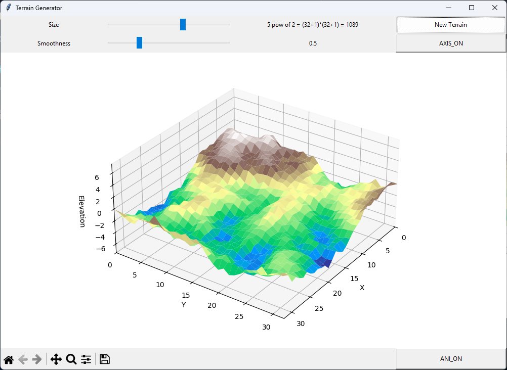

# Terrain generator

This app generate the landscape using diamond-square alghorithm.



## Installation

```bash
git clone https://github.com/Artem1k/Landscapes.git
cd Landscapes
pip install -r requirements.txt

# run
python tk_gui.py
```

## Features

- generating/regenerating landscape(New Terrain)
- increase/decreade resolution(Size)
- increase/decrease max/min height(smoothness)
- enable/disabel animation(ANI_ON/ANI_OFF)
- turn on/off axis(AXIS_OFF/AXIS_ON)
- export stl(save icon)